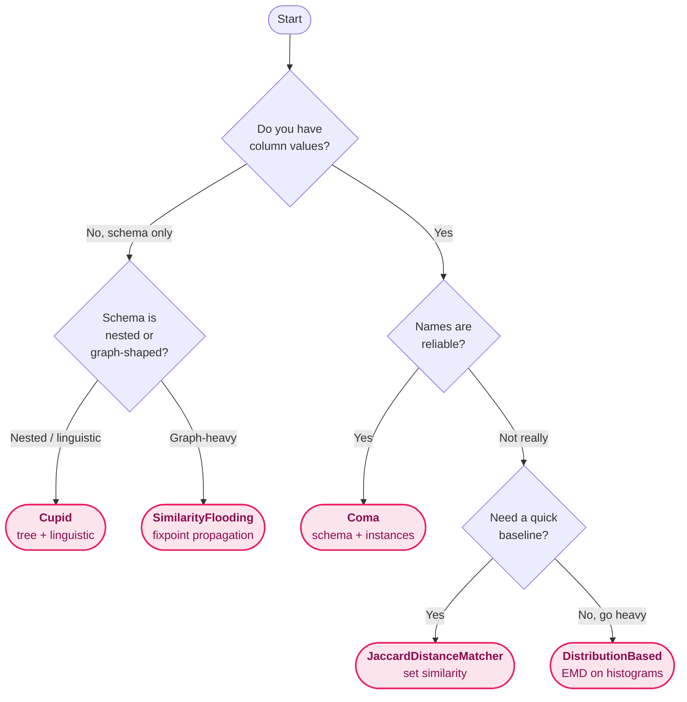

# Matchers

This page is the **conceptual guide** to Valentine's five matching
algorithms: what each one does, when to reach for it, and the trade-offs
involved. For constructor signatures, parameter defaults, and validation
rules, head straight to the [API reference](api.md#matchers-valentinealgorithms).

Every matcher in Valentine subclasses [`BaseMatcher`](api.md#basematcher)
and is compatible with the top-level
[`valentine_match`](api.md#valentine_match) API. All five live in
`valentine.algorithms`:

```python
from valentine.algorithms import (
    Coma,
    Cupid,
    DistributionBased,
    JaccardDistanceMatcher,
    SimilarityFlooding,
)
```

| Matcher                     | Signals                   | Best for                                                                  |
|-----------------------------|---------------------------|---------------------------------------------------------------------------|
| [`Coma`](#coma)                           | Schema + instances (optional) | General-purpose first choice. Strong defaults, informative sub-scores. |
| [`Cupid`](#cupid)                         | Schema only               | Nested schemas where column names and structure matter more than data.   |
| [`DistributionBased`](#distributionbased) | Instances only            | Matching by value distributions when names are unreliable.               |
| [`JaccardDistanceMatcher`](#jaccarddistancematcher) | Instances only  | Simple, explainable baseline. Useful for sanity checks.                  |
| [`SimilarityFlooding`](#similarityflooding) | Schema only             | Structure-heavy schemas where graph neighbourhoods carry signal.         |

## Which matcher should I pick?



When in doubt, start with [`Coma`](#coma) — it's the strongest default
and the only matcher that ships per-sub-matcher
[score breakdowns](results.md#match-details-coma).

## `Coma`

Pure-Python implementation of the COMA 3.0 schema matching algorithm.
COMA (COmbination of MAtching algorithms) composes multiple sub-matchers
— each targeting a different aspect of schema or data similarity — and
combines their scores.

**Schema matchers** (enabled by `use_schema=True`, the default):

- **Name** — trigram (Dice) similarity on column names
- **Path** — trigram similarity on dot-separated schema paths
- **Leaves** — name similarity across all leaf-level columns
- **Parents** — structural similarity via parent-level leaf comparison

**Instance matcher** (enabled by `use_instances=True`):

- **TF-IDF cosine similarity** — each cell value is treated as a document,
  a global IDF is computed across all columns of both tables, and
  per-column similarity is aggregated with a max-matching Dice formula.

After computing all-pairs similarity scores, a selection step filters
results using bidirectional best-match logic (DIR_BOTH) controlled by
`max_n`, `delta`, and `threshold`. When matching more than two tables
via [`get_matches_batch`](api.md#get_matches_batch), the TF-IDF corpus is
built once from **all** tables.

```python
from valentine.algorithms import Coma

matcher = Coma(use_instances=True)
```

!!! tip "Match explanations"

    Coma is the only matcher that fills in per-sub-matcher score
    breakdowns. After running Coma, call `matches.get_details(pair)` to
    see how each individual sub-matcher contributed to the final score.
    See [Match details](results.md#match-details-coma).

**Performance.** Schema-only mode is dominated by trigram comparisons —
roughly *O(n_left · n_right · L)* in column counts and average name
length. Adding `use_instances=True` builds a TF-IDF corpus over **all**
sampled cell values across **all** input tables, so cost grows linearly
with `instance_sample_size` (default `1000`) and the total number of
columns. Expect sub-second matching for two ~30-column tables, single
seconds for ~100 columns, and tens of seconds once you cross a few
hundred columns with instances enabled. Memory scales with the size of
the TF-IDF vocabulary; lower `instance_sample_size` if you hit a wall.

[:material-book-marked: Full parameter reference &rarr;](api.md#coma)

## `Cupid`

Python implementation of [*Generic Schema Matching with Cupid*][cupid]
(Madhavan, Bernstein & Rahm, VLDB 2001). Cupid combines linguistic
similarity of column names with structural similarity derived from the
shape of the schema tree. Use it when you have deep or nested schemas
and the column data is unavailable or unreliable.

  [cupid]: https://www.vldb.org/conf/2001/P049.pdf

```python
from valentine.algorithms import Cupid

matcher = Cupid(w_struct=0.2, leaf_w_struct=0.2, th_accept=0.7)
```

**Performance.** Schema-only and independent of row counts, so cost is
driven entirely by the size of the schema tree. Expect sub-second
matching for typical relational schemas (tens to a few hundred
columns). Deeply nested or wide schemas (XML/JSON-shaped) push runtime
into seconds because the structural pass propagates similarities across
neighbouring nodes.

[:material-book-marked: Full parameter reference &rarr;](api.md#cupid)

## `DistributionBased`

Python implementation of [*Automatic Discovery of Attributes in
Relational Databases*][zhang] (Zhang et al., SIGMOD 2011). Columns are
compared by quantile histograms of their value distributions; Earth
Mover's Distance drives the ranking of matches within each cluster.
Great for numeric or categorical data where names give you nothing to
work with.

  [zhang]: https://dl.acm.org/doi/10.1145/1989323.1989336

```python
from valentine.algorithms import DistributionBased

matcher = DistributionBased(threshold1=0.15, threshold2=0.15)
```

When you pass more than two tables, Valentine calls
[`get_matches_batch`](api.md#get_matches_batch), which DistributionBased
overrides to compute **global** value ranks across every table at once —
giving each pair the benefit of the full data landscape.

**Performance.** The most compute-heavy matcher in the package. Cost is
dominated by Earth Mover's Distance computations between column
histograms; runtime scales roughly *O(n_columns² · sample_size · log)*
per pair, so it grows fast with both column count and
`instance_sample_size`. As a rule of thumb, expect single-digit seconds
for ~30 columns at the default sample size, and minutes once you cross
~100 columns or use the full DataFrame. Lower `instance_sample_size`
aggressively for exploration runs, then bump it up for the final pass.

[:material-book-marked: Full parameter reference &rarr;](api.md#distributionbased)

## `JaccardDistanceMatcher`

A simple, explainable instance-based baseline. Columns are compared by
Jaccard similarity of their value sets, with element equality decided
by a configurable string distance function (Levenshtein, Jaro–Winkler,
exact, …). Useful as a sanity check alongside a heavier matcher, or as
a fast first pass on clean, short-valued columns.

```python
from valentine.algorithms import JaccardDistanceMatcher
from valentine.algorithms.jaccard_distance import StringDistanceFunction

matcher = JaccardDistanceMatcher(
    threshold_dist=0.8,
    distance_fun=StringDistanceFunction.Levenshtein,
)
```

The element-equality function is configured with the
[`StringDistanceFunction`](api.md#stringdistancefunction) enum, which
exposes `Levenshtein`, `DamerauLevenshtein`, `Hamming`, `Jaro`,
`JaroWinkler`, and `Exact`.

**Performance.** Fast and predictable. With `Exact` element equality
the cost is essentially set-intersection — milliseconds per column
pair. Switching to a string-distance function turns each comparison
into an *O(|A| · |B|)* cross-product over column value sets, so it
slows down quickly once columns hold more than a few hundred unique
values. Use it as a fast first pass, or pair it with
`StringDistanceFunction.Exact` on clean, short-valued columns.

[:material-book-marked: Full parameter reference &rarr;](api.md#jaccarddistancematcher)

## `SimilarityFlooding`

Python implementation of [*Similarity Flooding: A Versatile Graph
Matching Algorithm and its Application to Schema Matching*][sf]
(Melnik, Garcia-Molina & Rahm, ICDE 2002). Each schema is represented
as a labelled graph; an initial element-level similarity is iteratively
propagated across the graph until a fixpoint is reached. Shines on
structure-heavy schemas where graph neighbourhoods carry signal beyond
what pure string matching can pick up.

  [sf]: https://ieeexplore.ieee.org/document/994702

```python
from valentine.algorithms import (
    Formula,
    Policy,
    SimilarityFlooding,
    StringMatcher,
)

matcher = SimilarityFlooding(
    coeff_policy=Policy.INVERSE_AVERAGE,
    formula=Formula.FORMULA_C,
    string_matcher=StringMatcher.PREFIX_SUFFIX,
)
```

Behaviour is parameterized by three enums:
[`Policy`](api.md#policy) controls the propagation coefficients,
[`Formula`](api.md#formula) selects the fixpoint iteration formula, and
[`StringMatcher`](api.md#stringmatcher) picks the initial element-level
similarity function. When you select `StringMatcher.PREFIX_SUFFIX_TFIDF`
and run with more than two tables, Valentine computes a global IDF from
every table's schema vocabulary.

**Performance.** Schema-only and dominated by the fixpoint iteration
over the propagation graph. Each iteration is *O(|edges|)*, and the
graph size grows with the number of schema elements (columns + types +
labels). Expect sub-second runtime on small relational schemas, single
seconds on schemas with hundreds of elements. Convergence is the main
variable: pick a tighter `Formula` if iterations stretch out, and
prefer `StringMatcher.PREFIX_SUFFIX` over `PREFIX_SUFFIX_TFIDF` when
you don't need cross-table corpus statistics.

[:material-book-marked: Full parameter reference &rarr;](api.md#similarityflooding)

## Writing a custom matcher

Every matcher subclasses [`BaseMatcher`](api.md#basematcher) and
implements at minimum the [`get_matches`](api.md#get_matches) method.
Override [`get_matches_batch`](api.md#get_matches_batch) if you can
exploit a holistic view over every table. Populate
[`match_details`](api.md#match_details) from inside your matcher if you
want to surface sub-scores to users via
[`MatcherResults.get_details`](api.md#get_details).

Invalid parameters should raise `ValueError` at construction time —
the built-in matchers follow this convention for threshold ranges,
negative counts, and mutually-exclusive flags.
